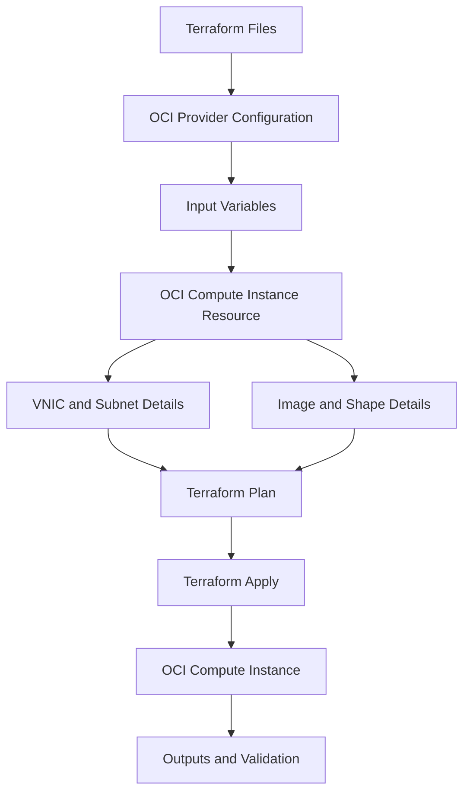

# OCI Compute Terraform Deployment Validation

## Overview

This repository explains a simple OCI Compute instance deployment and validation flow using Terraform.

It covers how Terraform configuration files, provider settings, input variables, compute instance resource definition, VNIC details, source image details, validation commands, expected results, and cleanup steps work together.

The focus is simple:

- Review the Terraform provider setup
- Define input variables
- Configure a sample OCI Compute instance
- Use placeholder values safely
- Run Terraform validation commands
- Review expected results
- Clean up test resources after validation

No confidential information, tenancy details, OCIDs, private keys, real subnet IDs, real image IDs, real IP addresses, or project-specific information is included.

---

## Why I Created This

Terraform is useful only when the configuration is clear and controlled.

For an OCI Compute instance, the important points are not only the instance name and shape. The review should also include compartment, availability domain, subnet, image, SSH key, VNIC settings, output values, and cleanup steps.

This repository keeps that flow simple and practical.

---

## Product Used

Oracle Cloud Infrastructure Compute and Terraform Provider for OCI

---

## Terraform Deployment Flow



---

## Components Covered

This repository covers the following areas:

- OCI Terraform provider
- Compute instance resource
- Provider configuration
- Input variables
- Terraform variable example file
- VNIC and subnet reference
- Image OCID reference
- SSH public key metadata
- Terraform format, init, validate, plan, apply, and destroy flow
- Expected results
- Cleanup steps
- Common validation issues

---

## Repository Contents

```text
README.md
.gitignore
versions.tf
provider.tf
variables.tf
main.tf
outputs.tf
terraform.tfvars.example

architecture/
  compute-terraform-flow.md

docs/
  compute-terraform-review.md
  product-usage-summary.md

validation/
  terraform-command-flow.md
  expected-results.md
  cleanup-steps.md

troubleshooting/
  common-issues.md
```

---

## What I Understood

My main understanding is that Terraform deployment should be reviewed before applying changes.

The provider connects Terraform to OCI. Variables keep the configuration reusable. The compute instance resource defines the server. The VNIC details connect the instance to a subnet. The source details define the image used for the boot volume.

Before applying, the configuration should be formatted, initialized, validated, and reviewed using Terraform plan.

Cleanup is also part of the validation flow. A test resource should not be left running after the review is complete.

---

## Clean Usage Note

This repository uses placeholders, sample names, and sample Terraform configuration only.

It does not include copied code from another person, real OCIDs, private keys, real subnet IDs, real image IDs, tenancy details, real IP addresses, or project-specific information.
