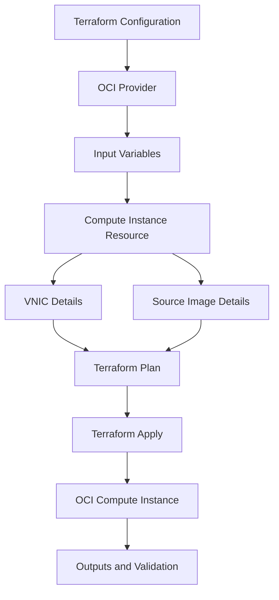

# Compute Terraform Flow

This diagram shows a simple OCI Compute deployment flow using Terraform.

Terraform reads the configuration files and provider settings.

The provider connects to OCI. The variables provide environment-specific values. The compute instance resource defines the instance, VNIC, subnet, image, shape, and SSH key metadata.

---

## What I Understood

My main understanding is that Terraform should not be treated only as code to create resources.

The configuration should be reviewed before apply. The variable values, subnet, image, shape, and SSH key should be checked carefully because incorrect values can fail the deployment or create the instance in the wrong place.
